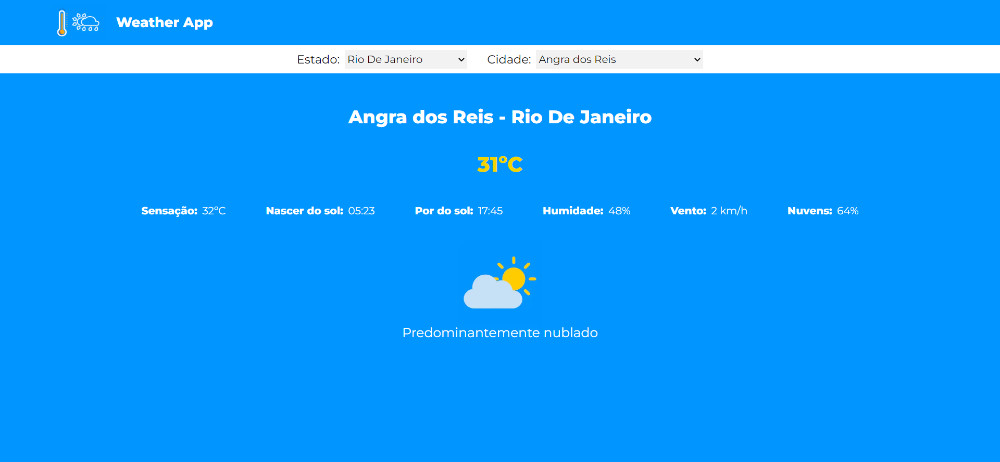
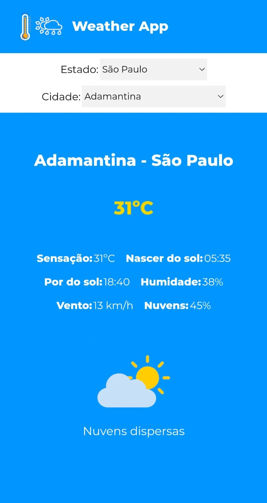

# Weather App

This project consumed data from the Open Weather Map API.

## Technologies used
* Next.js
* Typescript
* Styled-components
* HTML
* Axios

## Functionalities
* User can select the state and the city to have information about the weather;
* Information available: temperature, feels like, sunrise time, sunset time, wind speed, humidity and cloudiness;
* Depending on the weather, a different picture is displayed on the screen;
* This project is responsive to all screen sizes.

## Link to access the project
[www.weather-map.com](https://weather-app-olive-seven-60.vercel.app/)

## Installing
<pre>
  <code>$ git clone https://github.com/francinehahn/weather-app.git</code>
</pre>

<pre>
  <code>$ cd weather-app</code>
</pre>

<pre>
  <code>$ npm install</code>
</pre>

## Images
### Desktop version

### Mobile version

